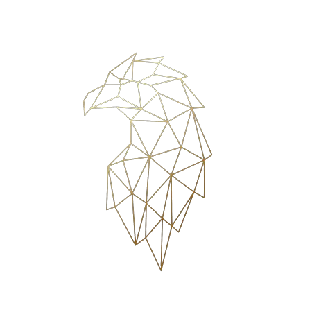

# 🦁 Fabricio Pérez - Portfolio

> A modern, performance-focused portfolio showcasing my journey as a Full Stack Developer & UX/UI Designer.

[](https://fabricio-prz-dev.vercel.app/)
[](https://angular.io/)
[](https://www.typescriptlang.org/)

<div align="center">
  
</div>

---

## ✨ Features

- 🎨 **Modern Design** - Minimalist UI with golden accents and glass morphism effects
- ⚡ **Performance First** - 60fps guaranteed, no heavy animations or canvas effects
- 📱 **Fully Responsive** - Mobile-first design, looks perfect on all devices
- 🎯 **Smooth Navigation** - Scroll snap, active section indicators, and seamless transitions
- ♿ **Accessible** - WCAG compliant with keyboard navigation and screen reader support
- 🌙 **Optimized** - Lazy loading, efficient animations, and clean code architecture

---

## 🚀 Tech Stack

### Frontend
- **Framework:** Angular 17+ (Standalone Components)
- **Language:** TypeScript 5.0+
- **Styling:** SCSS with custom design system
- **Icons:** Font Awesome 6.x
- **Animations:** CSS3 with cubic-bezier transitions

### Tools & Deployment
- **Version Control:** Git & GitHub
- **Package Manager:** npm
- **Build Tool:** Angular CLI
- **Hosting:** Vercel
- **Design:** Figma

---

## 📂 Project Structure

```
portfolio/
├── src/
│   ├── app/
│   │   ├── components/
│   │   │   ├── header/          # Navigation bar
│   │   │   ├── hero/            # Landing section
│   │   │   ├── experience/      # Work experience timeline
│   │   │   ├── skills/          # Technical skills grid
│   │   │   ├── projects/        # Project showcase
│   │   │   ├── certifications/  # Certificates display
│   │   │   └── contact/         # Contact information
│   │   ├── app.component.ts     # Main app component
│   │   └── app.routes.ts        # Route configuration
│   ├── assets/                  # Static assets
│   ├── styles/                  # Global styles
│   └── index.html
├── public/                      # Public assets
└── README.md
```

---

## 🎨 Design System

### Color Palette
```scss
--gold:         #C9A961  // Primary golden
--gold-light:   #D4B575  // Light golden
--gold-dark:    #B89647  // Dark golden
--bg:           #0A0A0D  // Deep black
--surface:      rgba(20, 20, 25, 0.8)  // Glass surface
--text:         #FFFFFF  // Primary text
--text-dim:     rgba(255, 255, 255, 0.6)  // Secondary text
```

### Typography
- **Headings:** Space Grotesk (800 weight)
- **Body:** System font stack with fallback
- **Monospace:** Space Mono

---

## 🛠️ Installation & Setup

### Prerequisites
- Node.js 18.x or higher
- npm 9.x or higher
- Angular CLI 17.x or higher

### Local Development

1. **Clone the repository**
   ```bash
   git clone https://github.com/FabricioPRZ/MY-PORTFOLIO.git
   cd MY-PORTFOLIO
   ```

2. **Install dependencies**
   ```bash
   npm install
   ```

3. **Run development server**
   ```bash
   ng serve
   ```

4. **Open browser**
   Navigate to `http://localhost:4200/`

### Build for Production

```bash
ng build --configuration production
```

The build artifacts will be stored in the `dist/` directory.

---

## 📊 Performance

- ⚡ **Lighthouse Score:** 95+ Performance
- 🎯 **First Contentful Paint:** < 1.2s
- 📦 **Bundle Size:** Optimized and tree-shaken
- 🚀 **Load Time:** < 2s on 4G connection

---

## 🎯 Key Sections

### 🏠 Hero
Modern landing section with profile image, stats, and tech stack showcase.

### 💼 Experience
Interactive timeline displaying professional journey with achievements and technologies.

### ⚡ Skills
Categorized skills display with animated progress bars and proficiency levels.

### 🚀 Projects
Horizontal showcase with scroll navigation featuring live demos and source code links.

### 🎓 Certifications
Grid display of professional certifications with verification links.

### 📧 Contact
Multiple contact methods with direct links to email, WhatsApp, LinkedIn, and GitHub.

---

## 🌟 Highlights

- **2+ Years** of professional development experience
- **30+ Projects** completed successfully
- **8+ Certifications** from Google, AWS, and Cisco
- Specialized in **Angular** with expertise in **React** and **Vue**
- Full stack proficiency: **TypeScript, Python, Java, Go**

---

## 🤝 Connect With Me

<div align="center">

[](mailto:agustinaconstantino55@gmail.com)
[](https://www.linkedin.com/in/victor-fabricio-perez-constantino-8727512b6/)
[](https://github.com/FabricioPRZ)
[](https://fabricio-prz-dev.vercel.app/)

</div>

---

## 🙏 Acknowledgments

- Design inspiration from modern portfolio trends
- Icons by [Font Awesome](https://fontawesome.com/)
- Hosting by [Vercel](https://vercel.com/)

---

<div align="center">

**Made by Fabricio Pérez**

⭐ Star this repo if you found it helpful!

</div>